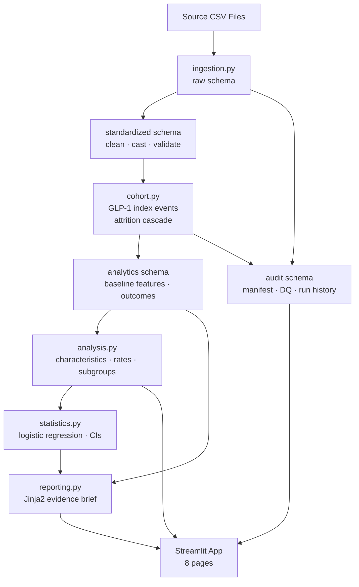
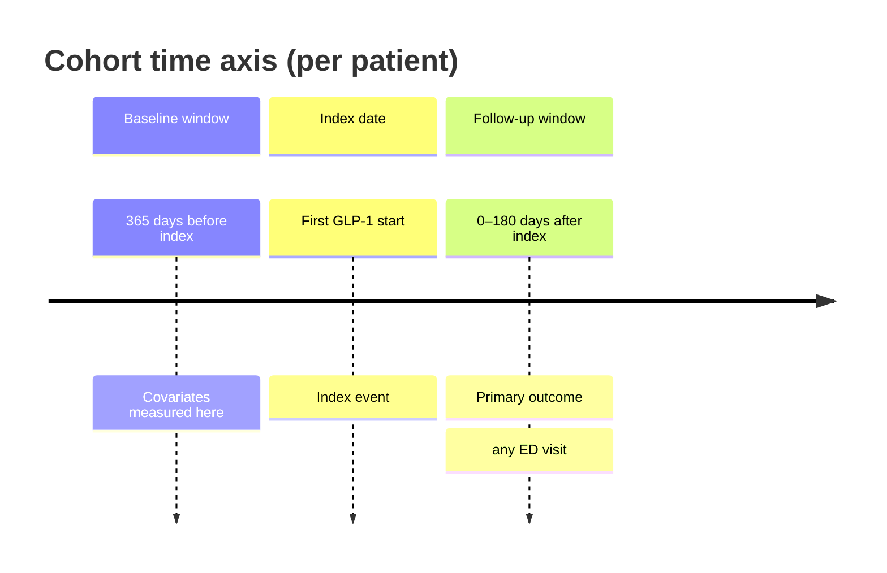

# Real-World Evidence Studio

> **Synthetic data only.** All results are derived from synthetic records.
> They do not represent real patients, clinical outcomes, treatment
> effectiveness, drug safety, or incidence rates. This project must not be
> used for clinical decisions, regulatory submissions, or public health
> reporting.

A portfolio-grade, local Streamlit application that demonstrates transparent
real-world evidence (RWE) generation from synthetic EHR data.

---

## Clinical question

> Among synthetic adult patients with type 2 diabetes who initiate a GLP-1
> therapy, what patient characteristics are associated with emergency department
> (ED) utilization during the following 180 days?

---

## Architecture



---

## Study design



### Cohort definition summary

| Parameter | Value |
|-----------|-------|
| Exposure | GLP-1 initiation (semaglutide, liraglutide, dulaglutide, exenatide, tirzepatide) |
| Index date | First observed GLP-1 medication start |
| Age at index | ≥ 18 years |
| Required history | ≥ 365 days of observation before index |
| Required follow-up | ≥ 180 days after index (or until death) |
| Primary outcome | Any ED encounter in follow-up window |
| Exclusions | Type 1 diabetes, gestational diabetes, pregnancy at index |
| Baseline window | 365 days before index date |
| Default follow-up | 180 days (configurable: 30 / 90 / 180 / 365) |

---

## App pages

| Page | What it shows |
|------|---------------|
| Overview | Project summary, data status, pipeline diagram |
| Data Quality | Source-file manifest, DQ rule results, missingness |
| Study Designer | Concept-set inspection, inclusion/exclusion toggles, follow-up window |
| Cohort Attrition | Waterfall diagram with patient counts at each step |
| Results | Characteristics table, outcome rates, subgroup comparisons, regression forest plot |
| SQL & Audit Trail | All generated SQL, assumption log, study-run history |
| Evidence Brief | Downloadable Markdown/HTML brief with all 20 sections |
| Methodology | Study design narrative and full limitations |

---

## Technical stack

| Layer | Technology |
|-------|-----------|
| Language | Python 3.11+ |
| Analytical DB | DuckDB (in-process, file-backed) |
| Source data | Synthea-compatible synthetic CSVs (see `docs/data_setup.md`) |
| Query language | SQL (primary logic layer) |
| App framework | Streamlit (`st.Page` / `st.navigation`) |
| Charts | Plotly |
| Statistics | Statsmodels (logistic regression) |
| Configuration | Pydantic v2 + YAML |
| Templating | Jinja2 |
| Testing | Pytest |
| Linting / format | Ruff |

---

## Quick start

> **Python 3.11 or newer is required.** Check with `python --version`.

```bash
# 1. Clone this repository
git clone <repo-url>
cd real-world-evidence-studio

# 2. Create and activate a virtual environment
python -m venv .venv
# macOS / Linux:
source .venv/bin/activate
# Windows:
.venv\Scripts\activate

# 3. Install with development dependencies
pip install -e ".[dev]"

# 4. Obtain source data — two options (see docs/data_setup.md):
#    Option A: Official Synthea (preferred) — requires Java 11+
#    Option B: Bundled custom demo generator (no Java required)
#      python scripts/generate_demo_data.py --output-dir data/raw/
# Place CSVs in:  data/raw/

# 5. Run the full pipeline
# For Synthea data:
evidence-studio ingest --data-dir data/raw/ --data-source official_synthea
# For custom demo data:
# evidence-studio ingest --data-dir data/raw/ --data-source custom_synthetic_demo
evidence-studio dq-report
evidence-studio build-cohort
evidence-studio analyze
evidence-studio export-brief

# 6. Launch the app
streamlit run app.py
```

### Or: run the app first (before data)

```bash
streamlit run app.py
```

The app handles missing data gracefully — every page displays a setup guide
when DuckDB or source files are not yet present.

---

## Data sources

This project supports two data modes. Both produce Synthea-compatible CSV files
and pass the same ingestion pipeline; they differ in provenance and fidelity.

| Mode | How to obtain | `--data-source` flag | When to use |
|------|--------------|----------------------|-------------|
| **Official Synthea** (preferred) | `java -jar synthea.jar -p 2000` | `official_synthea` | Realistic disease module outputs; requires Java 11+ |
| **Custom demo generator** | `python scripts/generate_demo_data.py` | `custom_synthetic_demo` | Local validation without Java; not epidemiologically representative |

**Important:** The custom demo generator exists to exercise application code
paths without requiring Java. It uses hard-coded demonstration probabilities
that do **not** reproduce Synthea's disease modules, clinical logic, prevalence
rates, prescribing patterns, or outcome distributions. Passing all 18
data-quality checks confirms structural consistency only — it does **not**
validate clinical realism.

Demo cohort sizes, ED rates, subgroup findings, and regression coefficients
produced from the custom generator are not scientific findings and must not
be presented as expected or representative results.

---

## Running tests

```bash
# Run all tests (no source data download needed)
pytest

# With verbose output
pytest -v

# Single file
pytest tests/unit/test_cohort_boundaries.py -v
```

### Linting and formatting

```bash
ruff check .
ruff format --check .
# Auto-fix formatting:
ruff format .
```

---

## Documentation

| Document | Description |
|----------|-------------|
| [docs/architecture.md](docs/architecture.md) | Data flow, DuckDB schema, module responsibilities |
| [docs/methodology.md](docs/methodology.md) | Study design, concept sets, inclusion criteria |
| [docs/data_dictionary.md](docs/data_dictionary.md) | Column definitions for all schema layers |
| [docs/data_setup.md](docs/data_setup.md) | How to obtain and place Synthea data |
| [docs/omop_mapping.md](docs/omop_mapping.md) | OMOP demonstration layer decisions and limitations |
| [docs/limitations.md](docs/limitations.md) | Analytic and data limitations |
| [docs/testing.md](docs/testing.md) | Test strategy, fixture design, CI pipeline |
| [docs/demo_script.md](docs/demo_script.md) | 3-minute portfolio walkthrough script |
| [docs/future_roadmap.md](docs/future_roadmap.md) | Planned enhancements |

---

## Contributing

See [CONTRIBUTING.md](CONTRIBUTING.md).

---

## License

See [LICENSE](LICENSE).

---

*Johanna Momole — Healthcare Informatics Portfolio*
